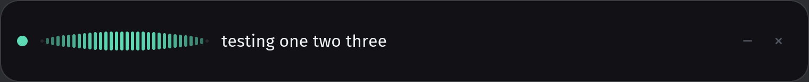

# Murmur

[](https://tokentip.to/@copyleftdev)

Voice typing that never leaves your machine. Hold a key, speak, release — the
text lands wherever your cursor already is.

Murmur is a local-first replacement for hosted dictation tools. No audio leaves
the computer, there is no account, and there is nothing to subscribe to.

## Why this is hard, and where the hard part actually is

The machine learning is the easy half. NVIDIA Parakeet transcribes faster than
you can talk on any recent GPU, and it runs offline.

The difficult half is putting the text somewhere useful. Wayland deliberately
gives an unfocused background process no way to type into another application,
and the workarounds differ per compositor:

| Path | Works on | Limits |
| --- | --- | --- |
| `/dev/uinput` virtual keyboard | everything, incl. GNOME | scancodes only, so US-layout ASCII |
| `ext-data-control` clipboard | wlroots, KDE | **not GNOME** — mutter exposes neither data-control protocol |
| RemoteDesktop portal keysyms | GNOME, KDE | full Unicode, one consent prompt |
| XTEST | X11 / XWayland | not native Wayland clients |

Measured on GNOME Shell 49 (`murmur doctor` will tell you what *your* session
supports). The clipboard-paste trick that most dictation tools rely on simply
does not work on GNOME, which is why Murmur types through the kernel by default.

## Status

Working today:

- **NVIDIA Parakeet TDT 0.6B v3** transcription via ONNX Runtime, verified
  against a clip with a known transcript (21x realtime on CPU with int8 weights)

- Pure, IO-free session logic — push-to-talk, double-tap hands-free, tap
  rejection, utterance caps, transcription timeouts, continuation spacing
- Text formatting — custom dictionary (multi-word), spoken commands
  (`new line`, `new paragraph`, `scratch that`), spacing policy
- Microphone capture with rolling pre-roll, so the first syllable survives
  starting to talk before the key is fully down
- 16 kHz resampling and voice-activity trimming, verified against synthetic tones
- Global push-to-talk read from evdev, working regardless of compositor policy
- Text injection through a `/dev/uinput` virtual keyboard, verified end to end
- Latency accounting reported as percentiles of *release to text*

Also working, with one important caveat:

- **NVIDIA Nemotron 3.5 cache-aware streaming ASR** (`murmur transcribe --stream`),
  which transcribes while you speak. See "Why streaming is not the default" below.

- **Live partial text** while you speak, produced by re-running the same batch
  model over the growing recording on a worker thread

- **An iced overlay** (`murmur hud`): state, level and live text in one bar

Not yet:
- RemoteDesktop portal backend for full Unicode on GNOME
- Optional Nemotron polish pass

## Models

Murmur transcribes with NVIDIA Parakeet TDT 0.6B v3, exported to ONNX. The int8
weights are 640 MB and quite fast enough on a CPU:

```sh
MD=~/.local/share/murmur/models/parakeet-tdt-0.6b-v3
B=https://huggingface.co/istupakov/parakeet-tdt-0.6b-v3-onnx/resolve/main
mkdir -p "$MD" && cd "$MD"
for f in vocab.txt config.json nemo128.onnx \
         decoder_joint-model.int8.onnx encoder-model.int8.onnx; do
  curl -L -O "$B/$f"
done
```

Swap `encoder-model.int8.onnx` for `encoder-model.onnx` + `encoder-model.onnx.data`
(2.5 GB) for full precision.

### GPU

```sh
cargo build --release --features cuda
```

Measured on two RTX 3080 Ti, 11 seconds of speech, warm median of five runs:

| weights | device | median | realtime |
| --- | --- | --- | --- |
| int8 | CPU | 477 ms | 23x |
| int8 | CUDA | 460 ms | 24x |
| fp32 | CPU | 464 ms | 24x |
| **fp32** | **CUDA** | **36 ms** | **307x** |

**Use fp32 on a GPU** — and Murmur does this for you. int8 is a CPU
optimisation: the CUDA provider has no kernels for most quantised ops, so it
inserts hundreds of Memcpy nodes and shuttles the graph across the bus, arriving
exactly where it started.

Note that int8 is not *faster* on a CPU either; it is a quarter of the size. So
`asr.model_dir` points at a directory of models and `asr.precision = "auto"`
picks fp32 when the GPU can genuinely be used and int8 otherwise, to save 1.9 GB
of disk and memory when it cannot. `murmur doctor` shows the decision:

```
• model       parakeet-tdt-0.6b-v3 [Int8]
✓ model       parakeet-tdt-0.6b-v3-fp32 [Fp32]  ← selected
```

Set `precision` to `"fp32"` or `"int8"` to decide it yourself; an explicit
choice falls back rather than failing when those weights are not installed.

"Can the GPU genuinely be used" is three questions, not one: the build must have
a CUDA provider, the driver must report a device, *and* the userspace runtime
must be loadable. The driver is the misleading one — it ships with the kernel
module, so it is present on machines with no CUDA toolkit at all. Checking only
the driver selects 2.5 GB of fp32 weights and then runs them on the CPU.

The first call is always slower — kernel selection, autotuning and allocator
warm-up. `murmur transcribe --repeat N` reports it separately, because averaging
it in flatters or slanders the device depending only on how many times you ran it.

#### CUDA without root

ONNX Runtime's provider is linked against **CUDA 13**, which distributions lag
well behind. You do not need a system CUDA toolkit for this: only the *driver* is
privileged, and it is already installed. Everything else is ordinary userspace
shared objects, so Murmur keeps its own copy:

```sh
CD=~/.local/share/murmur/cuda
mkdir -p "$CD/wheels" "$CD/lib" && cd "$CD/wheels"
pip download --no-deps -d . nvidia-cuda-runtime nvidia-cublas nvidia-cudnn-cu13
for w in *.whl; do python3 -m zipfile -e "$w" extracted/; done
find extracted -name "*.so*" -type f -exec cp -P {} "$CD/lib/" \;
```

Undo it with `rm -rf ~/.local/share/murmur/cuda`. Nothing else on the system is
touched.

`LD_LIBRARY_PATH` cannot help here — glibc reads it once at process start — so
Murmur loads each library itself with `RTLD_GLOBAL`, which also satisfies the
sub-libraries cuDNN opens by bare name at runtime.

### Why streaming is not the default

Streaming ought to win. A batch model cannot start until the key is released, so
all of its inference lands inside the delay the user feels; a cache-aware
streaming model consumes the utterance as it happens and leaves only the last
chunk outstanding. Measured, that is exactly what happens:

| audio | batch, release to text | streaming tail |
| --- | --- | --- |
| 11 s | 35.7 ms | 14.0 ms |
| 66 s | 174.2 ms | 13.8 ms |

Batch latency scales with utterance length. The streaming tail is flat.

It still is not the default, because the streaming model decodes only on chunk
boundaries and cannot be made to emit its final partial chunk — up to 560 ms of
speech. Its API has no flush, and padding the tail does not induce one: neither
digital silence nor a noise floor yields a single token, because the decoder
emits on acoustic evidence rather than elapsed frames.

On a clip cut mid-utterance:

```
batch      "And so, my fellow Americans, ask not what"
streaming  "And so my fellow Americans, ask not"
```

Dictation ends precisely where that risk is highest — you release the key just
after your last word. A tool that usually drops it is not usable, and 20 ms of
latency is not worth a word.

So live text comes from the batch model instead. Parakeet transcribes 11 seconds
in 36 ms on a GPU, which makes re-transcribing the whole recording every few
hundred milliseconds cheap — and it means the words you watch appear are
produced by exactly the model that types them, rather than by a second model
that might disagree with it. No streaming weights required.

Three rules make that safe:

- **Inference never runs on the main loop.** A partial pass on the critical path
  would delay the release it is supposed to be hiding. It runs on a worker.
- **Stale snapshots are dropped, not queued.** By the time a queued snapshot is
  transcribed it is already out of date, and the next one is always better.
- **The pace is proportional.** A pass taking `d` earns a gap of `5d`, bounded to
  300 ms–2 s, so a long dictation on a slow machine backs off by itself instead
  of competing with the final pass for the device.

Both passes share one loaded model, so the final pass may wait for one partial to
finish — bounded, and cheaper than a second copy of the weights on the GPU.

`crates/murmur-asr/tests/streaming_accuracy.rs` pins the limitation, so if a
future export fixes it the test fails and tells us to revisit this.

#### Never trusting the device

ORT does not fail when a provider cannot be registered: it logs the error and
carries on using the CPU. A build asking for the GPU will therefore report
success while running at a fraction of the speed. Murmur watches ORT's own log
and reports the device it actually got:

```
model  parakeet-tdt-0.6b-v3 (int8) on cpu (cuda registration failed)
```

## Install

Packages carry both binaries, a desktop entry, the icon, and the udev rule that
makes `/dev/uinput` reachable.

```sh
./packaging/build.sh                 # builds .deb and .rpm into target/packages

sudo apt install ./target/packages/murmur_0.1.0-1_amd64.deb
sudo dnf install ./target/packages/murmur-0.1.0-1.x86_64.rpm
```

Then, once:

```sh
sudo usermod -aG input $USER   # log out and back in
murmur models pull             # fetches the speech model
murmur doctor                  # confirms the machine can run it
```

The group membership is left as a deliberate step rather than done by the
package. Read access to `/dev/input/event*` is the ability to read every
keystroke on the machine — Murmur needs it to know when the trigger key is held,
and no package should grant that quietly on your behalf.

Packages are built CPU-only. ONNX Runtime's CUDA provider is linked against a
particular CUDA major version and ships as shared objects that are not ours to
redistribute, so a packaged Murmur transcribes on the CPU — fast enough at 23x
realtime — and GPU users build with `--features cuda` and supply the runtime as
described under [GPU](#gpu).

## Try it

```sh
cargo build --release
./target/release/murmur doctor                    # what this session can and cannot do
./target/release/murmur selftest                  # prove injection, without typing on your screen
./target/release/murmur transcribe assets/jfk.wav # prove the model, offline
./target/release/murmur listen                    # the real thing
./target/release/murmur listen --mock             # the loop, without a model
```

`selftest` is worth understanding: it creates the virtual keyboard, opens its own
device node, `EVIOCGRAB`s it so the kernel delivers those events to nobody else,
types a probe string, and decodes what comes back. It exercises the real
injection path without spraying text across your desktop.

`transcribe` is the offline way to check a model and measure it — it reports the
realtime factor alongside the text, so a slow accelerator is visible immediately.

`listen --mock` runs the entire loop — trigger, capture, format, inject — with a
scripted transcriber. Focus a text editor first: it really does type.

## The overlay

```sh
murmur hud
```



One bar, one accent colour at a time — the colour *is* the state and the text
only elaborates. The meter is shaped like a voice rather than a bar chart: bar
heights follow a fixed raised-cosine profile scaled by a perceptual curve, since
speech spends most of its time well below unity and a linear meter therefore
looks broken.

Every state is covered by a snapshot test against a checked-in PNG, so a layout
regression fails the build. Delete the image to accept a new design.

### Putting it away

```sh
murmur hud --install   # desktop entry + icon, under ~/.local/share
```

While it runs, Murmur appears in the panel. Click the icon to hide or restore the
overlay; its menu offers the same, plus Quit. In the bar itself, `–` hides and `×`
quits — hiding leaves dictation working, which is the point of having somewhere to
put it.

GNOME dropped the legacy system tray but implements `StatusNotifierItem` through
the AppIndicator extension Ubuntu enables by default, which is why this speaks
that protocol directly rather than linking a toolkit. A desktop without it simply
gets no panel icon; everything else still works.

The icon is drawn, not shipped: the same waveform as the overlay, computed at
whatever size is asked for — 64px ARGB for the panel, 256px RGBA for the window,
and SVG for the icon theme. One geometry, no binary assets to drift out of step,
and no image decoder in the dependency tree.

### Placing it, and closing it

It sits bottom-centre by default, clear of the middle of the screen where you are
actually working. Three ways to move it:

```sh
MURMUR_HUD_ANCHOR=bottom-right murmur hud   # or bottom-left
MURMUR_HUD_MARGIN=32 murmur hud             # distance from the edge
```

…or just drag the bar. Close it with the `×`, or Escape while it still has focus.

Two things make placement work at all. Wayland gives a client no way to position
its own window — `xdg-shell` has no concept of a position, so the compositor
decides, and GNOME decides on the middle of the screen. Murmur therefore runs the
overlay through XWayland, which restores absolute placement; nothing else it does
touches Wayland, since injection is `uinput`, the trigger is evdev and audio is
ALSA. Set `MURMUR_HUD_WAYLAND=1` to keep the native surface and place it by
dragging instead.

And "centred" is not the centre of the desktop. X11 reports two 1920x1080
monitors as one 3840x1080 screen, so centring on that puts the bar exactly on the
bezel. There is no monitor list available at placement time, but the count can be
inferred by assuming conventional panels and seeing how many fit — which leaves an
ultrawide correctly undivided, because 3440x1440 is nowhere near twice 16:9.

### Focus, and why the window never hides

Text is injected into whichever window the compositor considers focused, so an
overlay that took focus would type into itself. Wayland gives a client no way to
refuse focus and GNOME implements no layer-shell protocol, so the window is
created once at start-up and never mapped or unmapped again — it only changes
what it draws. GNOME will focus it once when it appears; click into whatever you
want to dictate into, and it stays out of the way after that.

The engine runs on its own thread, because iced must own the main thread and a
microphone cannot leave the thread that opened it. That split is also why the
interface cannot stall dictation: the worst a slow frame can do is show stale
text.

## Layout

```
murmur-core     pure logic: session FSM, formatting, latency. No IO, no clock.
murmur-audio    capture, pre-roll, resampling, VAD
murmur-asr      the Transcriber trait, and a scripted implementation
murmur-hotkey   global push-to-talk via evdev
murmur-inject   uinput virtual keyboard, clipboard, backend routing
murmur-engine   the loop that performs core's commands and reports the facts
murmur-cli      doctor, selftest, listen, keys, mic, devices, config
murmur-hud      the iced overlay
```

The core is a pure function of its event log. Every device is behind a trait
with a fixture implementation, so the whole dictation loop is asserted on
machines with no microphone, no model and no window to type into.

## Configuration

```sh
murmur config --init   # writes ~/.config/murmur/config.toml
```

The trigger defaults to Right Ctrl. That is not arbitrary: evdev cannot swallow
a single key (`EVIOCGRAB` is all-or-nothing per device), so the push-to-talk key
must be one that does nothing on its own.

## Licence

Apache-2.0
